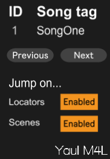
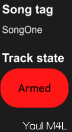

# MaxForLive - Song conductor
A way to quickly arm channels, fire clips and jump to locator when live performing multiple songs.

 

## Versions
**To be done.**

## Changelog
**To be done.**

## Description
**To be done.**

## Setup
**To be done.**